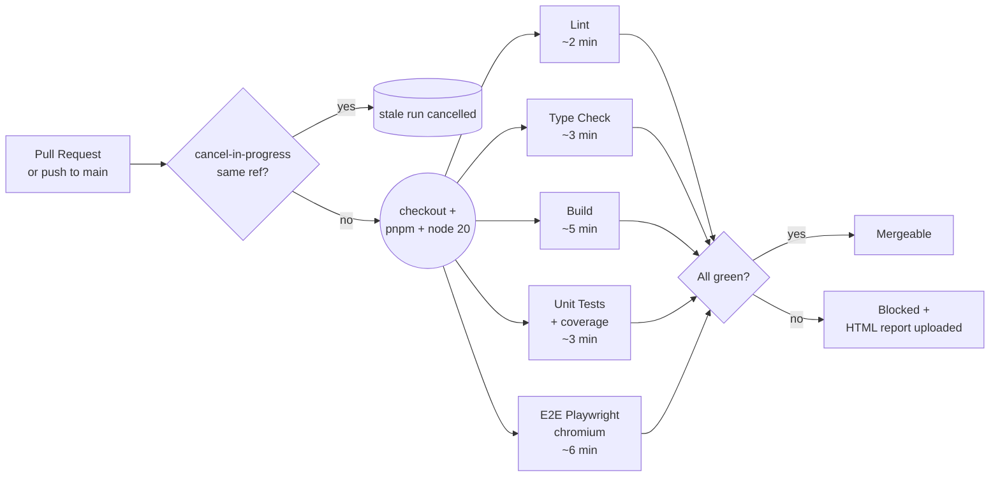

# CI/CD Pipeline — ReLoop

> Production-grade GitHub Actions workflow with 5 parallel jobs.
> Target: every PR validated in **< 8 minutes** before merge.

## Architecture



## Jobs

| Job | Command | Target | Notes |
|---|---|---|---|
| `lint` | `pnpm lint` | < 2 min | ESLint + Next.js core-web-vitals |
| `typecheck` | `pnpm typecheck` | < 3 min | `tsc --noEmit` strict |
| `build` | `pnpm build` | < 5 min | Next.js production build, needs `NEXT_PUBLIC_*` secrets |
| `unit` | `pnpm test:coverage` | < 3 min | Vitest + V8 coverage, uploads `coverage/` artifact |
| `e2e` | `pnpm e2e --project=chromium` | < 6 min | Playwright, builds + boots `pnpm start`, uploads HTML report |

All jobs run **in parallel** on `ubuntu-latest`. Wall-clock < 8 min.

## Local equivalents

```bash
pnpm lint          # job: lint
pnpm typecheck     # job: typecheck
pnpm build         # job: build
pnpm test          # job: unit (no coverage)
pnpm test:coverage # job: unit (with coverage)
pnpm e2e           # job: e2e (uses webServer auto-start)
```

## Required GitHub Secrets

Configure under **Settings → Secrets and variables → Actions**:

| Secret | Required by | Notes |
|---|---|---|
| `NEXT_PUBLIC_SUPABASE_URL` | `build`, `e2e` | Public URL of test Supabase project |
| `NEXT_PUBLIC_SUPABASE_ANON_KEY` | `build`, `e2e` | Anon key (safe to expose to client) |
| `SUPABASE_SERVICE_ROLE_KEY` | `e2e` | **Use a read-only or dedicated test project** — never the production key |

> **Recommendation:** spin up a separate Supabase project for CI E2E with seed
> data only. Never reuse production credentials.

## Concurrency

```yaml
concurrency:
  group: ci-${{ github.workflow }}-${{ github.ref }}
  cancel-in-progress: true
```

Pushing a new commit to a PR cancels the prior run on that branch. Saves
minutes and prevents stacking on busy days.

## Artifacts

| Artifact | When | Retention |
|---|---|---|
| `coverage-report` | always (unit job) | 7 days |
| `playwright-report` | always (e2e job) | 7 days |
| `playwright-traces` | only on E2E failure | 7 days |

Open `playwright-report/index.html` from the artifact zip to debug failed
E2E runs locally with full screenshots, videos, and traces.

## Failure modes & debug

| Symptom | Likely cause | Debug |
|---|---|---|
| `pnpm install` fails | Lockfile drift | `pnpm install` locally, commit `pnpm-lock.yaml` |
| Build fails on missing env | Secret not set in repo | Add via Settings → Secrets |
| E2E timeout waiting for server | `pnpm start` crash | Check job logs for "Error:" before Playwright start |
| Playwright "browser not installed" | Cache miss, install step skipped | Re-run job; cache key is `pnpm-lock.yaml` hash |
| Flaky E2E | Race in app or seed data | Download `playwright-traces`, open in `npx playwright show-trace` |

## Triggers

- `pull_request` to `main` — validates every contribution
- `push` to `main` — validates merged code, populates branch protection signals

## Branch protection (recommended)

In **Settings → Branches → main → Protect**:

- Require status checks: `Lint`, `Type Check`, `Build`, `Unit Tests`, `E2E (Playwright)`
- Require branches up to date before merging
- Require linear history (optional)

## Vercel preview URLs

The Vercel GitHub integration auto-comments preview URLs on every PR.
We do not need a custom workflow for that — see `vercel.json` and the
Vercel project settings.

## Future extensions

- Visual regression via Playwright screenshots (T2-08)
- Lighthouse CI for Core Web Vitals budgets (T2-09)
- Bundle-size diff comment via `next-bundle-analyzer`
- Storybook deploy via Chromatic
